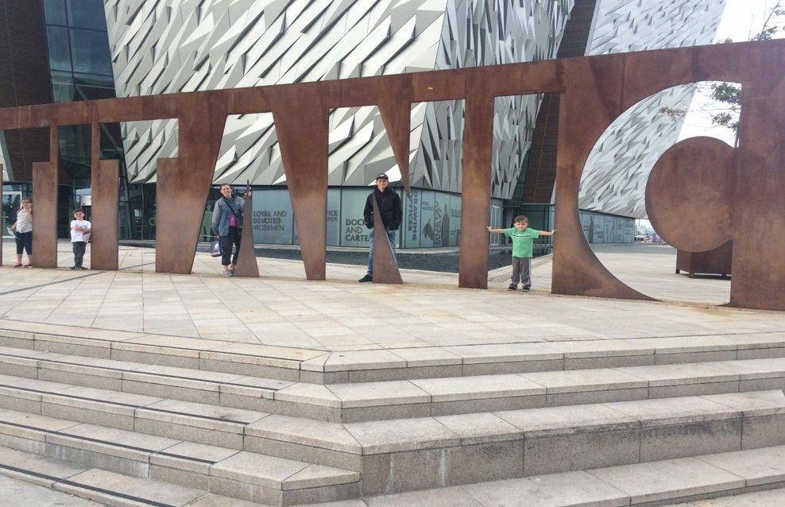

# Titanic Survivability Model



## Introduction
A few years ago I had to opportunity to visit the Titanic Museum in Belfast.  I learned about the lives of many of the passengers and what they had to endure that day.  When we entered the museum, we were given a name of one of the passengers and that is who we were “supposed to be” during our visit.  At the end of the tour, we got to find out if we survived or perished.  I didn’t make it.  I got to wondering why some people survived and some didn't.  Was is just luck, or were there certain characteristics that gave a person a better chance at survival?  This is the basis for my investigation of the Titanic dataset. 

## Data Sources Used
This project is based off the titanic3.csv dataset that is available [here](https://github.com/jbryer/CompStats/blob/master/Data/titanic3.csv).

## Technologies Used
* Python 3+
* Jupyter Notebook 5.7.8

## Required Packages  
```python
import pandas as pd
from __future__ import print_function, division
import os
from scipy.stats import chi2_contingency
import statsmodels.formula.api as smf
import numpy as np
import thinkstats2
import thinkplot
```

## Anlaysis Methods Used  
* Descriptive statistics  
* Correlation analyses  
* Graphic analyses
* Logistic modeling 
* Model accuracy

## Model Deployment
The final cell in the notebook allows the used to input their personal information to see if they would have survived the Titanic voyage.  The logistical model requires three variables: sex, age, and fare.  
***Sex is 1 for males and 0 for females***  
***Age is your age in years***  
***Fare is in British Pounds at the 1912 currency rate.  The notebook explains how to make the necessary conversions***  

##Summary of Results
When I entered my personal data for these three variables, the model predicted that I would have had a 20% chance of survival.   
